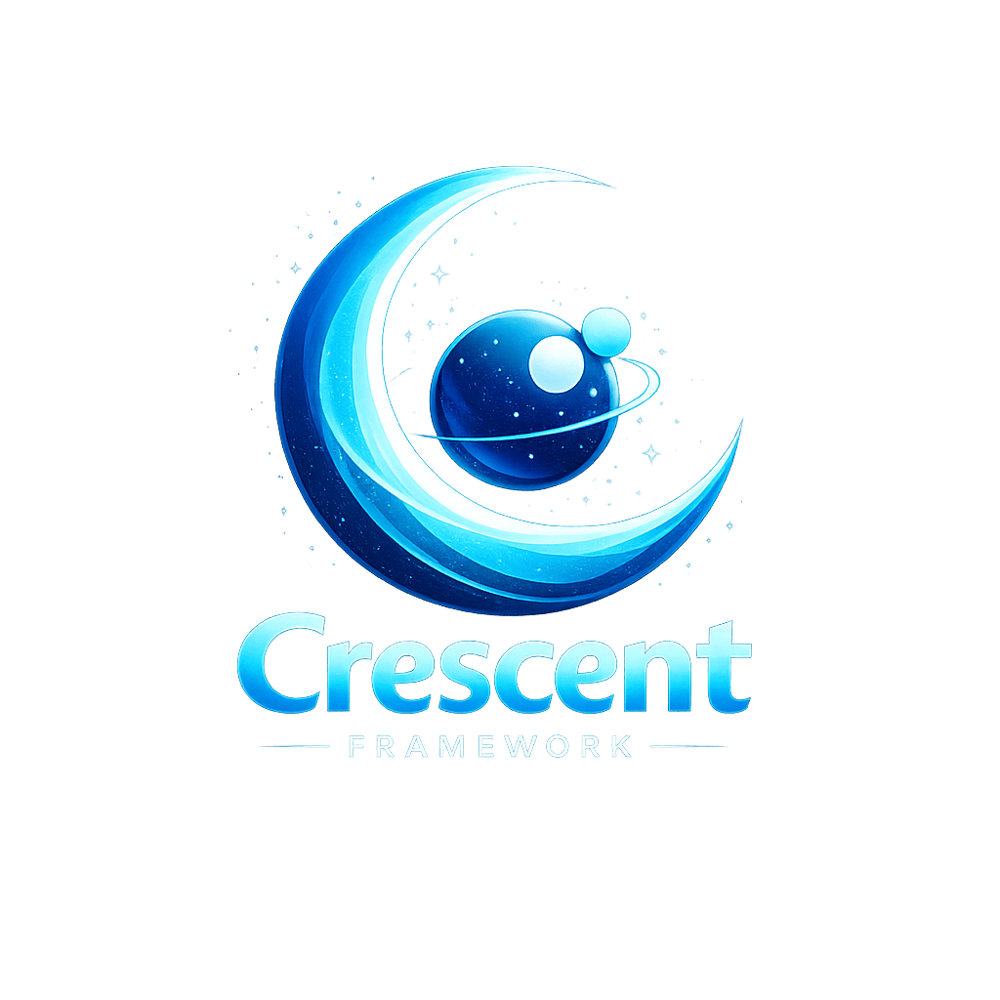

# 🌙 Crescent Framework



A modern, fast and elegant web framework for Luvit.

[](LICENSE)
[](https://luvit.io)

## ⚡ Quick Start

```bash
# Install Luvit (if not already installed)
curl -L https://github.com/luvit/lit/raw/master/get-lit.sh | sh

# Install Crescent Framework
lit install daniel-m-tfs/crescent-framework

# Create new project
crescent new myapp
cd myapp

# Configure
cp .env.example .env
nano .env

# Run
crescent server
# or
luvit app.lua
```

Server running at `http://localhost:3000` 🚀

## 🎯 Features

- ⚡ **Fast** - Built on Luvit (LuaJIT + libuv)
- 🛣️ **Routing** - Express-like routing system with parameters
- 🔌 **Middleware** - Extensible middleware pipeline
- 🗄️ **ORM** - Active Record pattern for MySQL
- 🔐 **Security** - CORS, Auth, and Security middleware built-in
- 🎨 **CLI** - Powerful code generators (controllers, models, migrations)
- 📦 **Modular** - Organize code in modules
- 🔄 **Migrations** - Database version control
- ✅ **Validation** - Built-in data validation

## 💻 CLI Commands

```bash
crescent new <name>              # Create new project from GitHub template
crescent server                  # Start development server
crescent make:module <name>      # Create complete CRUD module
crescent make:controller <name>  # Create controller
crescent make:service <name>     # Create service
crescent make:model <name>       # Create Active Record model
crescent make:routes <name>      # Create routes file
crescent make:migration <name>   # Create migration
crescent migrate                 # Run pending migrations
crescent migrate:rollback        # Rollback last migration
crescent migrate:status          # Show migration status
```

## 📖 Documentation

- **Installation Guide:** [INSTALLATION.md](INSTALLATION.md)
- **Database Guide:** [DATABASE.md](DATABASE.md)
- **Security Guide:** [SECURITY.md](SECURITY.md)
- **Website:** https://crescent.tyne.com.br
- **Starter Template:** https://github.com/daniel-m-tfs/crescent-starter

## 🔧 Requirements

- **Luvit** >= 2.18
- **Lit** (package manager, comes with Luvit)
- **Git** (for creating new projects)
- **MySQL** (optional, for database features)

### Install Luvit

```bash
# macOS / Linux / WSL
curl -L https://github.com/luvit/lit/raw/master/get-lit.sh | sh

# Or via Homebrew (macOS)
brew install luvit
```

This installs both `luvit` and `lit` (the package manager).

## 📦 Installation

### Option 1: Via Lit (Recommended)

```bash
# Install Crescent Framework
lit install daniel-m-tfs/crescent-framework

# Install MySQL support (optional)
lit install creationix/mysql

# The 'crescent' command will be available globally
crescent --help
```

### Option 2: From Source (Development)

```bash
# Clone the repository
git clone https://github.com/daniel-m-tfs/crescent-framework.git
cd crescent-framework

# Add to PATH (optional)
export PATH="$PATH:$(pwd)/bin"

# Test
luvit crescent-cli.lua --help
```

## 📁 Project Structure

```
myapp/
├── app.lua              # Entry point
├── bootstrap.lua        # Migration runner
├── config/
│   ├── development.lua  # Dev configuration
│   └── production.lua   # Production configuration
├── src/                 # Your application modules
│   └── users/           # Example module
│       ├── controllers/ # HTTP request handlers
│       ├── services/    # Business logic
│       ├── models/      # Database models (Active Record)
│       └── routes/      # Route definitions
├── migrations/          # Database migrations
├── public/             # Static files
└── tests/              # Tests
```

## 🚀 Example

```lua
local Crescent = require('crescent')
local env = require('config.development')

-- Create app
local app = Crescent.new(env)

-- Middleware
app:use(require('crescent.middleware.logger'))
app:use(require('crescent.middleware.cors'))

-- Routes
app:get('/', function(ctx)
    return ctx.json(200, { message = "Hello Crescent!" })
end)

app:get('/users/{id}', function(ctx)
    local id = ctx.params.id
    return ctx.json(200, { id = id, name = "John Doe" })
end)

app:post('/users', function(ctx)
    local body = ctx.body
    -- Validate and save user
    return ctx.json(201, body)
end)

-- Start server
app:listen()
```

## 🗄️ Active Record ORM

```lua
local Model = require("crescent.database.model")

local User = Model:extend({
    table = "users",
    timestamps = true,
    
    fillable = {
        "name", "email", "password"
    },
    
    hidden = {
        "password"
    },
    
    validates = {
        name = {required = true, min = 3},
        email = {required = true, email = true, unique = true}
    }
})

-- Usage
local user = User:create({
    name = "John Doe",
    email = "john@example.com",
    password = "secret"
})

local users = User:all()
local user = User:find(1)
user:update({name = "Jane Doe"})
user:delete()
```

## 🎨 Generate Complete Module

```bash
crescent make:module Product
```

This creates:
- ✅ Controller (`src/products/controllers/products.lua`)
- ✅ Service (`src/products/services/products.lua`)
- ✅ Model (`src/products/models/products.lua`)
- ✅ Routes (`src/products/routes/products.lua`)
- ✅ Module entry point (`src/products/init.lua`)

Then just register in `app.lua`:

```lua
local productsModule = require("src.products")
productsModule.register(app)
```

## 🔄 Database Migrations

```bash
# Create migration
crescent make:migration create_users_table

# Edit migration file in migrations/
# Then run:
crescent migrate

# Rollback if needed:
crescent migrate:rollback
```

## 🤝 Contributing

Contributions are welcome! Please feel free to submit a Pull Request.

1. Fork the repository
2. Create your feature branch (`git checkout -b feature/amazing-feature`)
3. Commit your changes (`git commit -m 'Add amazing feature'`)
4. Push to the branch (`git push origin feature/amazing-feature`)
5. Open a Pull Request

## 📄 License

MIT License - see [LICENSE](LICENSE) file for details.

## 🔗 Links

- **Starter Template:** https://github.com/daniel-m-tfs/crescent-starter
- **Documentation:** https://crescent.tyne.com.br
- **LuaRocks:** https://luarocks.org/modules/daniel-m-tfs/crescent-framework
- **Issues:** https://github.com/daniel-m-tfs/crescent-framework/issues

## 💡 Why Crescent?

Built with the same philosophy as Express.js and inspired by NestJS and Laravel, Crescent brings modern web development patterns to the Lua ecosystem through Luvit's powerful async/await model.

- 🚀 **Performance** - LuaJIT's blazing fast execution
- 🔄 **Async** - Non-blocking I/O with libuv
- 🎨 **Elegant** - Clean, expressive syntax
- 📦 **Batteries included** - ORM, migrations, validation, auth
- 🛠️ **Developer friendly** - Powerful CLI and generators

---

Made with ❤️ for the Lua community
